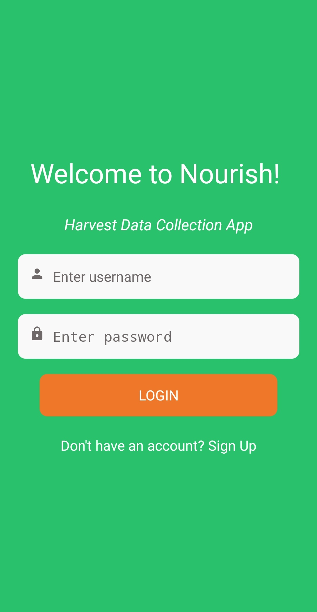
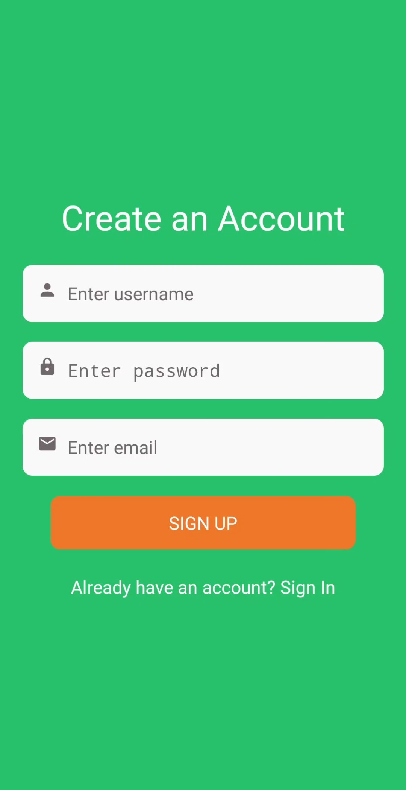
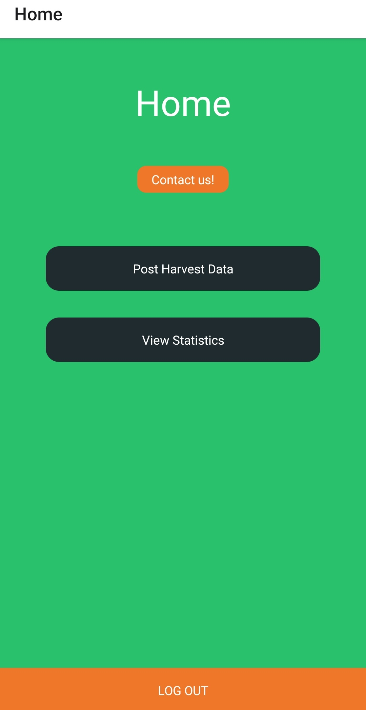
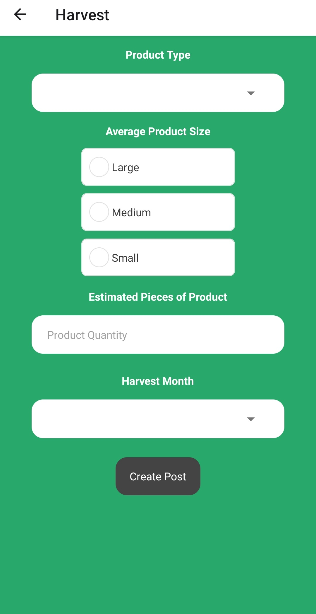
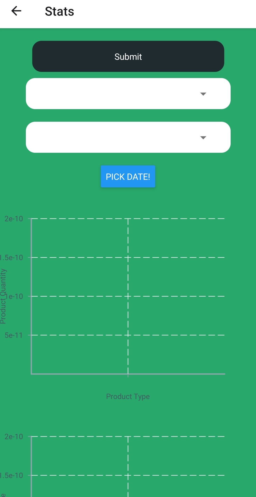
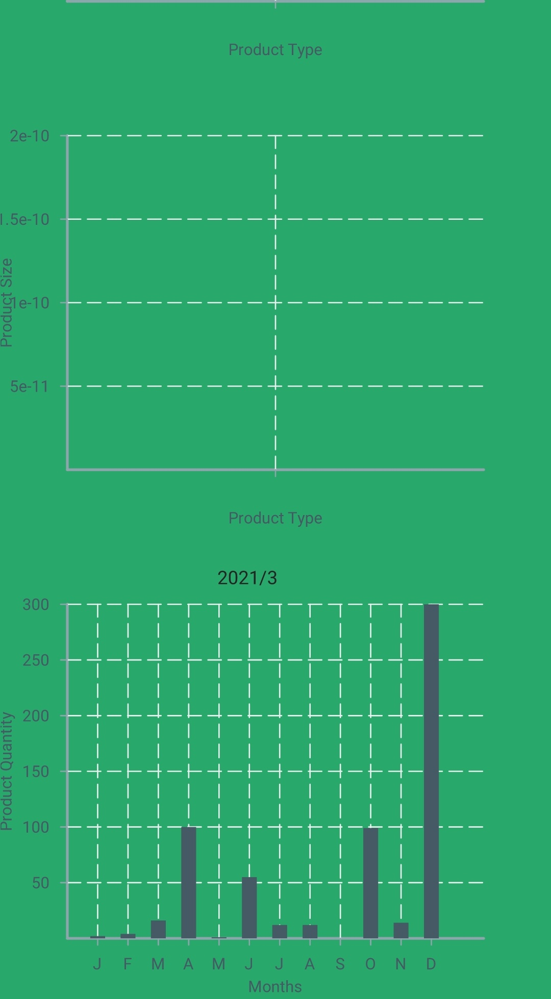

# Nourish - Local Garden Growth Application

This project is currently in-progress. Please come back for final release!

## Project Name  
Nourish: Harvest Data Collection App

## Description  
This app was designed to allow for local gardeners in Peterborough to submit and track data about the quality and quantity of crops they grow. This data is meant to allow the client, [Nourish](https://www.nourishproject.ca/), to get a better idea of how much food is being grown by the community.   

### Features   
1. _Login Page_
    1. User can login to their account via their username and password.
    2. They may request to sign-up if they do not hold an account.
    3. This is the page that is first visible when the app is opened. 
   
2. _Sign-Up Page_
    1. Users may sign-up for an account with a valid username, password, and email id (Amplify Authentication Service)
    2. This leads them to the Confirm Sign-Up Page -> users need to enter verification code to successfully create account
    3. After their account creation, they are led back to the login page where they must sign-in.

3. _Home Page_
    1. Users have the option to talk to Nourish via the Contact-Us Button. The button leads them [here](https://nourishproject.ca/contact-us).
    2. There are two options on the page: 
        1. Harvest Data - See more info on 4. 
        2. Display Statistics - See more info on 5. 
    3. Users have the option to log-out of their account via the button at the bottom of the page -> leads them to login. 
    
4. _User-Posts Page_ 
    1. Users come to this page when they press "Harvest Data" on the Home Page
    2. Users can enter the type of crop, the size of the crop, the quantity, and the month it was harvested
    3. The 'create post' button will tell them that they harvest data has been successfully recorded in our database.
    
5. _Statistics Page_
    1. Users come to this page when they press "Display Statistics" on the Home Page
    2. Users have the option to see crops unique to the user as well as crops grown by the Peterborough Community. 
    3. They can filter by product type vs quantity, product type vs size, and product type vs timeline 

## Usage  
The app uses a set of forms to take in user info and then allows the user to view that data in various graphs. It also uses a standard sign up and login so we can seperate data based on user. This app will be available on the [App Store](https://www.apple.com/ca/app-store/) for IOS and [Google Play Store](https://play.google.com/store) for Android.   

### Visuals  

1. _Login Page_
    1.    

2. _Sign-Up Page_
    1.    

3. _Home Page_
    1.    

4. _User-Posts Page_
    1.   

5. _Statistics Page_
    1.    
    2.    

## Authors and Acknowledgment  
This project was worked on by: Matthew Allen, Mitchell Cummings and Vanshree Mathur. We would like to thank the Nourish team for all their insight and guidance throughout this project. We would also like to thank our Professor, Omar Alam, for his support and counselling this year.

